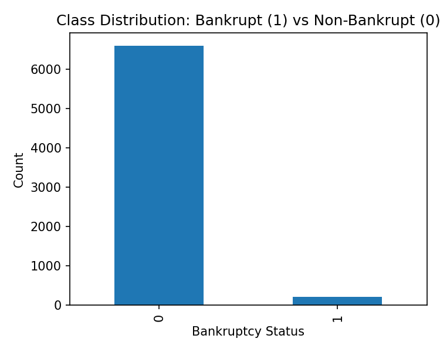
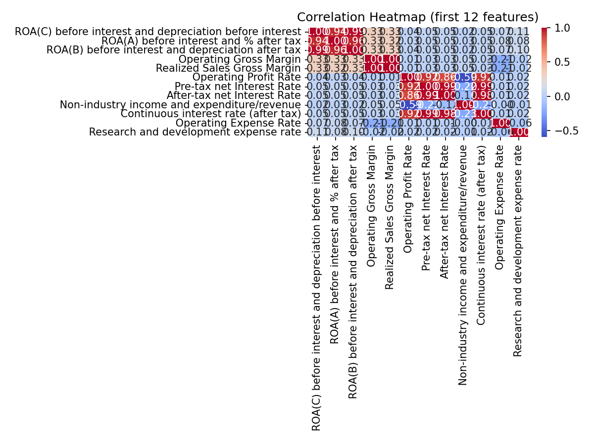
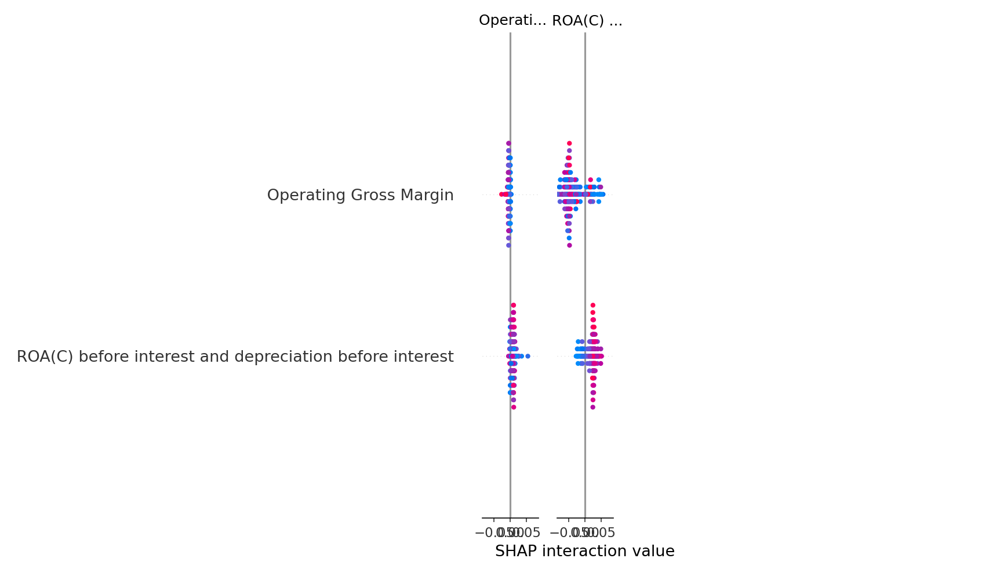

# Training Pipeline Report

## Overview

- Rows × Columns: **6819 × 96**
- Target positive rate: **3.23%** (1s=220, 0s=6599)
- Random seed: **42**

## EDA (Visualizations & Insights)

**Highly correlated pairs (|r| ≥ 0.90):**

- ** Current Liabilities/Liability** ↔ ** Current Liability to Liability**: |r| = 1.00
- ** Current Liabilities/Equity** ↔ ** Current Liability to Equity**: |r| = 1.00
- ** Debt ratio %** ↔ ** Net worth/Assets**: |r| = 1.00
- ** Operating Gross Margin** ↔ ** Gross Profit to Sales**: |r| = 1.00
- ** Net Value Per Share (A)** ↔ ** Net Value Per Share (C)**: |r| = 1.00
- ** Operating Gross Margin** ↔ ** Realized Sales Gross Margin**: |r| = 1.00
- ** Realized Sales Gross Margin** ↔ ** Gross Profit to Sales**: |r| = 1.00
- ** Net Value Per Share (B)** ↔ ** Net Value Per Share (A)**: |r| = 1.00
- ** Net Value Per Share (B)** ↔ ** Net Value Per Share (C)**: |r| = 1.00
- ** Operating Profit Per Share (Yuan ¥)** ↔ ** Operating profit/Paid-in capital**: |r| = 1.00

## Preprocessing & Selected Features

- Train-median imputation → correlation filter (|r|>0.90) → IQR winsorization → StandardScaler.
- Selected features: **74** (top 20 shown):  ROA(C) before interest and depreciation before interest,  Operating Gross Margin,  Operating Profit Rate,  Non-industry income and expenditure/revenue,  Operating Expense Rate,  Research and development expense rate,  Cash flow rate,  Interest-bearing debt interest rate,  Tax rate (A),  Net Value Per Share (B),  Persistent EPS in the Last Four Seasons,  Cash Flow Per Share,  Revenue Per Share (Yuan ¥),  Operating Profit Per Share (Yuan ¥),  Realized Sales Gross Profit Growth Rate,  Operating Profit Growth Rate,  After-tax Net Profit Growth Rate,  Continuous Net Profit Growth Rate,  Total Asset Growth Rate,  Net Value Growth Rate
- Artifacts: `preproc/selected_features.csv`, `preproc/winsor_bounds.csv`, scalers/imputers in `preproc/`.

## Hyperparameter Tuning (RandomizedSearchCV, CV=5, scoring=PR-AUC)

| Model | Best CV PR-AUC | Best Params |
|------:|---------------:|-------------|
| logreg | 0.4245 | `{"penalty": "l1", "C": 0.0379269019073225}` |
| rf | 0.4393 | `{"n_estimators": 300, "min_samples_split": 10, "min_samples_leaf": 4, "max_features": "sqrt", "max_depth": null}` |
| xgb | 0.4796 | `{"subsample": 1.0, "reg_lambda": 0.5, "reg_alpha": 0.0, "n_estimators": 500, "max_depth": 8, "learning_rate": 0.04000000000000001, "colsample_bytree": 0.7}` |

Full best-params JSON: `models/best_params.json`

## Model Evaluation & Comparison

- Metrics: ROC-AUC, PR-AUC, F1@0.5, Brier (train & test).  
- Comparison table (CSV): `evaluation/model_comparison.csv`.
- Curves per model saved in `evaluation/`: `*_roc.png`, `*_pr.png`, `*_calibration.png`.

## Calibration, ROC & Brier

- **Calibration**: compare predicted probability vs observed frequency (lower Brier is better).  
- **ROC-AUC**: threshold-insensitive separability.  
- **Precision–Recall**: recommended for imbalanced targets.

## SHAP (Best Model)

## Population Stability Index (PSI)

- PSI results CSV: `drift/psi_results.csv`.  
- Bar chart: `drift/psi_bar.png`; histograms in `drift/psi_hists/`.  
- Reference thresholds: 0.10 (monitor), 0.25 (investigate).

## Reproducibility & Dependencies

- Deterministic seed usage (Python/NumPy/sklearn CV).
- Key packages:
  - numpy: 2.2.6
  - pandas: 2.3.1
  - scikit-learn: 1.7.1
  - matplotlib: 3.10.5
  - seaborn: 0.13.2
  - xgboost: 3.0.4
  - shap: 0.48.0
